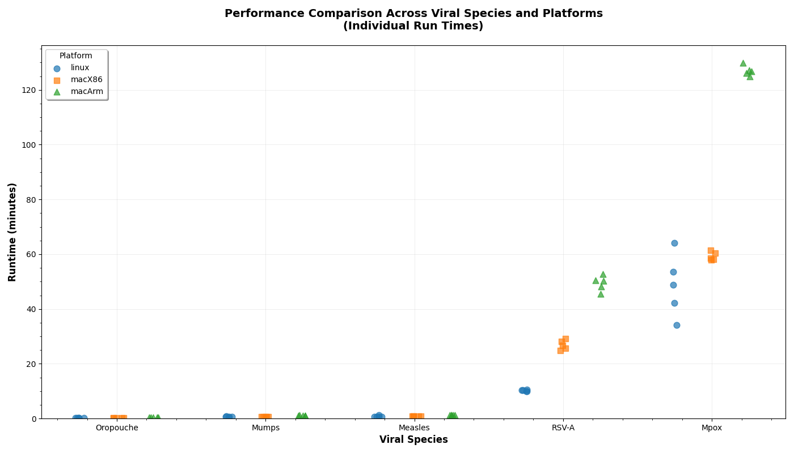

# Timing comparison

To characterize the speed of `viral_usher build` for viruses of different genome sizes and different numbers of available sequences on several platforms, I ran `viral_usher build` (release v0.7.0) 5 times each on each of the viruses summarized in the table below on the following platforms:
- Linux: Intel(R) Xeon(R) CPU E7-8870 v4 @ 2.10GHz, 160 cores, Red Hat 11.4.1-3
- Mac x86: MacBook Pro 2019, Intel(R) Core i7 @ 2.6GHz, 6 cores, Ventura 13.6.1
- Mac ARM: MacBook Pro 2023, Apple(R) M2 Max, 12 cores, Ventura 13.7.6

| Species         | RefSeq length | GenBank genome count | Filtered count | Aligned count | Has Nextclade dataset | Linux run time | Mac x86 run time | Mac ARM run time |
|:-----------|-----------:|------:|-------:|--------:|:------|---------------:|---------------:|---------------:|
| Oropouche  | 4385 (M)   | 2629  |  1597  | 800 (M) | no    | 0.29m, 0.30m, 0.30m | 0.24m, 0.26m, 0.28m | 0.50m, 0.51m, 0.52m |
| Mumps      | 15384      | 14584 |  1334  | 1334    | no    | 0.56m, 0.57m, 0.79m | 0.61m, 0.63m, 0.67m | 1.07m, 1.12m, 1.19m |
| Measles    | 15894      | 24693 |  1231  | 1231    | yes   | 0.63m, 0.64m, 1.25m | 0.81m, 0.82m, 0.84m | 1.28m, 1.36m, 1.38m |
| RSV        | 15222 (A)  | 58971 | 17630  | 17627   | yes   | 9.92m, 10.37m, 10.65m | 24.82m, 26.63m, 29.19m | 45.60m, 50.32m, 52.69m |
| Mpox       | 196858 (1) | 10584 |  9941  | 9935    | yes   | 34.19m, 48.91m, 64.21m | 58.00m, 58.53m, 61.40m | 124.80m, 126.86m, 129.83m |
Notes:
- run times are min, median, max in minutes
- (M): The M segment RefSeq was selected, and only sequences that successfully aligned to the M segment were included in the tree.
- (A): The RSV-A subtype RefSeq was selected.  Both RSV-A and RSV-B sequences aligned successfully to the RSV-A RefSeq.
- (1): The Mpox clade 1 RefSeq was selected.  Both clade 1 and 2 sequences aligned successfully to the clade 1 RefSeq.

## Summary
Small viruses with around 1000 available sequences that pass filters take about a minute (or less).  Larger viruses like Mpox and viruses with tens of thousands of sequences that pass filters take tens to hundreds of minutes; having a large number of CPU cores helps.  Newer Macs with ARM CPUs are actually slower than older Macs because of the emulation penalty when running a Linux x86 Docker image.

## Details
The script [timing_test.sh](timing_test.sh) contains the `viral_usher init` and `viral_usher build` commands.  It was run on each platform, and times were collected in the file [run_time.tsv](run_time.tsv).  The script [timing_plot.py](timing_plot.py) (which requires matplotlib and pandas to be installed) reads run_time.tsv and generates a plot of run times and the mean ± stddev values in the summary table above.  The logs_*/ directories contain the output of each run including the number of seconds taken by various steps in the build pipeline.